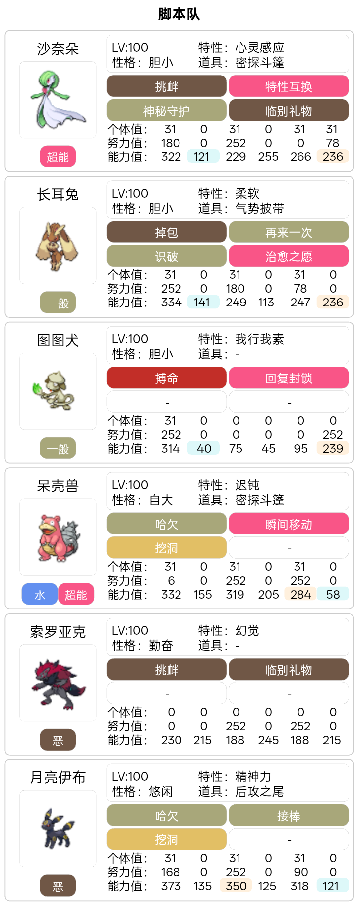

# pokemmo_auto_alpha

> ⚠️ **所有文件均由 AI 生成，无任何人类输入**

## 项目简介

Pokemmo 头目自动报点与打法推荐工具。定时检测蓝鼻子工具箱公开的头目刷新 API，解析头目信息（名称、特性、技能、蛋组、性别比例、地点、报点人），对双性别头目自动生成甜蜜球队伍出招推荐，并通过 WxPusher 实时推送到手机。

## 功能特性

- 自动定时检查头目刷新，跨时段自动去重（`time.txt` 记录已处理时段）
- 解析头目名称、特性、技能、蛋组、性别比例与报点人
- 仅对双性别头目（含白名单）生成队伍出招推荐，单性别头目只推送信息不推打法
- 技能解析失败时自动重新请求 API，最多重试 3 次（立即、延迟 0.5s、延迟 1s），全部失败则兜底继续推送
- 支持调试模式，从本地缓存文件读取数据离线测试
- WxPusher 实时推送订阅

## 工作流程

1. `alpha.py` 定时运行，判断当前头目刷新时段是否已处理
2. 若需要处理，调用 `fetch.py` 请求头目 API 并解析数据
3. 技能解析失败（moves 为空）时自动重试重新请求，最多 3 次
4. 调用 `autodoalpha.py` 生成打法推荐报告
5. 通过 `send.py` 推送到 WxPusher，并写入 `time.txt` 标记时段已处理

## 文件说明

| 文件 | 功能描述 |
|------|--------|
| alpha.py | 调度入口脚本。读取 `time.txt`；若文件为空，或记录的是上一轮头目刷新时段，则运行 `fetch.py`，否则直接退出 |
| fetch.py | 请求头目 API，提取图鉴 ID、头目基础信息、报点人信息；使用图鉴 ID 读取 `data.json` 获取头目名称、蛋组、雄性概率；调用 `autodoalpha.py` 生成打法；组装消息通过 send 推送到手机。技能解析失败时自动重试 3 次 |
| autodoalpha.py | 接收头目数据，生成战斗出招推荐。仅双性别头目输出打法，单性别头目不输出 |
| send.py | 通过 WxPusher 发送消息 |
| time.txt | 记录上一轮处理完成的头目刷新时段，用于去重逻辑 |
| data.json | 宝可梦静态数据，保存头目中文名称、蛋组、性别概率等基础资料 |
| alphadebug.json | 调试缓存文件，存储 API 原始响应内容 |

## 部署配置

1. 注册 WxPusher 并获取 appToken
2. 关注订阅：https://wxpusher.zjiecode.com/wxuser/?type=2&id=45385#/follow
3. 设置环境变量 `WXPUSHER_APP_TOKEN_alpha`
4. 配置定时任务，每分钟执行一次 `python3 alpha.py`

## 环境变量配置

| 环境变量 | 有效值 | 说明 |
|---|---|---|
| alpha_debug | `0` / `1` | 调试模式开关。`1`：开启调试，读取 `alphadebug.json`；`0`：正常请求 api |
| WXPUSHER_APP_TOKEN_alpha | 字符串 | WxPusher 推送 Token |

## 自用甜蜜头目队伍配置

## 致谢

感谢每一位积极上报头目刷新的报点玩家。
本工具的头目原始数据全部来自各位报点人的无私上报，没有大家的热心报点，本套自动提醒工具将无法运行，在此向所有头目报点者致以谢意。

## 免责声明

1. 项目全部脚本代码由 AI 生成，无人工手写代码，使用者自行承担部署、运行带来的全部风险。
2. 本项目仅用于学习研究用途，请严格遵守 Pokemmo 用户协议。
3. 项目依赖蓝鼻子工具箱公开头目 API，若 API 接口发生变动、下线，脚本会直接失效。
